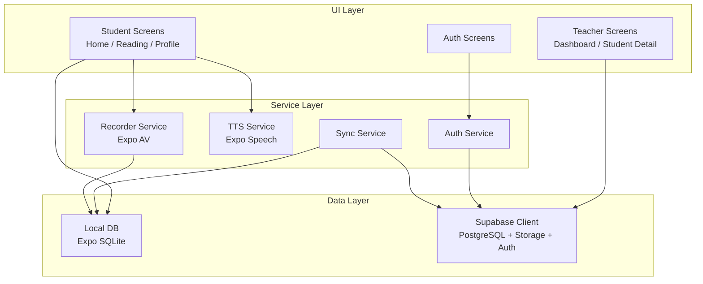
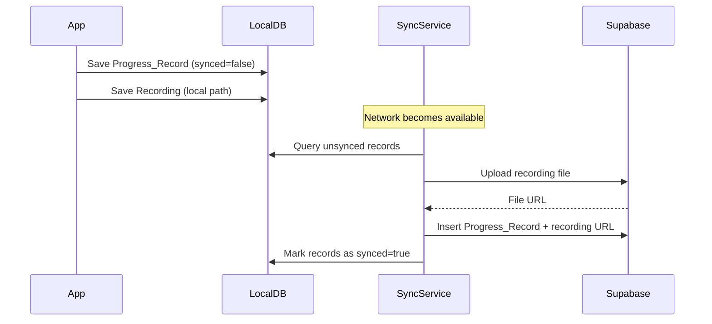

# Design Document: Mobile Reading App

## Overview

The Mobile Reading App is a React Native (Expo) application that helps students improve reading fluency through structured reading sessions, TTS playback, voice recording, and progress tracking. Teachers get a dedicated dashboard to monitor student performance.

The app is designed offline-first: all core functionality works without a network connection using a local SQLite database. When connectivity is available, a background sync service uploads pending data to Supabase (PostgreSQL + Storage).

Key design goals:
- Offline-first with transparent background sync
- Role-based UX (student vs. teacher flows)
- Minimal friction for recording and playback
- Secure, token-based auth via Supabase Auth

---

## Architecture

The app follows a layered architecture with clear separation between UI, service, and data layers.



### Connectivity & Sync Flow



---

## Components and Interfaces

### Auth Service

Wraps Supabase Auth. Persists session to AsyncStorage for cross-restart auth state.

```typescript
interface AuthService {
  register(email: string, password: string, role: 'student' | 'teacher'): Promise<Session>
  login(email: string, password: string): Promise<Session>
  logout(): Promise<void>
  getSession(): Promise<Session | null>
}
```

### TTS Service

Wraps Expo Speech. Exposes play/stop and rate control.

```typescript
interface TTSService {
  speak(text: string, rate: number): void   // rate: 0.5–2.0
  stop(): void
  isAvailable(): Promise<boolean>
}
```

### Recorder Service

Wraps Expo AV. Manages microphone permission, recording lifecycle, and local file persistence.

```typescript
interface RecorderService {
  requestPermission(): Promise<boolean>
  startRecording(): Promise<void>
  stopRecording(): Promise<string>  // returns local file URI
}
```

### Local DB (SQLite)

Accessed via a thin repository layer. All writes are synchronous from the app's perspective; sync happens out-of-band.

```typescript
interface ReadingMaterialRepo {
  getAll(): Promise<ReadingMaterial[]>
  upsert(material: ReadingMaterial): Promise<void>
}

interface ProgressRepo {
  save(record: ProgressRecord): Promise<void>
  getByStudent(studentId: string): Promise<ProgressRecord[]>
  getUnsynced(): Promise<ProgressRecord[]>
  markSynced(id: string): Promise<void>
}

interface RecordingRepo {
  save(recording: RecordingEntry): Promise<void>
  getUnsynced(): Promise<RecordingEntry[]>
  markSynced(id: string, remoteUrl: string): Promise<void>
}
```

### Sync Service

Runs on network-state change events (via `@react-native-community/netinfo`). Uploads unsynced recordings and progress records in the background.

```typescript
interface SyncService {
  sync(): Promise<SyncResult>
}

interface SyncResult {
  uploadedRecordings: number
  uploadedProgressRecords: number
  errors: SyncError[]
}
```

### Navigation

Role-based root navigator:
- `student` role → `StudentNavigator` (Home, Reading, Profile)
- `teacher` role → `TeacherNavigator` (Dashboard, StudentDetail)

---

## Data Models

### Local SQLite Schema

```sql
CREATE TABLE reading_materials (
  id TEXT PRIMARY KEY,
  title TEXT NOT NULL,
  content TEXT NOT NULL,
  difficulty_level TEXT NOT NULL,  -- 'easy' | 'medium' | 'hard'
  cached_at INTEGER NOT NULL       -- Unix timestamp
);

CREATE TABLE progress_records (
  id TEXT PRIMARY KEY,             -- UUID generated client-side
  student_id TEXT NOT NULL,
  material_id TEXT NOT NULL,
  material_title TEXT NOT NULL,
  score INTEGER NOT NULL,          -- 0–100
  fluency_rating TEXT NOT NULL,
  words_per_minute INTEGER NOT NULL,
  session_date INTEGER NOT NULL,   -- Unix timestamp
  synced INTEGER NOT NULL DEFAULT 0  -- 0 = pending, 1 = synced
);

CREATE TABLE recordings (
  id TEXT PRIMARY KEY,
  progress_record_id TEXT NOT NULL,
  local_uri TEXT NOT NULL,
  remote_url TEXT,                 -- null until synced
  synced INTEGER NOT NULL DEFAULT 0
);
```

### Supabase (PostgreSQL) Schema

```sql
-- Managed by Supabase Auth
-- profiles table extends auth.users
CREATE TABLE profiles (
  id UUID PRIMARY KEY REFERENCES auth.users(id),
  role TEXT NOT NULL CHECK (role IN ('student', 'teacher')),
  teacher_id UUID REFERENCES profiles(id)  -- null for teachers
);

CREATE TABLE reading_materials (
  id UUID PRIMARY KEY DEFAULT gen_random_uuid(),
  title TEXT NOT NULL,
  content TEXT NOT NULL,
  difficulty_level TEXT NOT NULL,
  created_at TIMESTAMPTZ DEFAULT now()
);

CREATE TABLE progress_records (
  id UUID PRIMARY KEY,             -- client-generated UUID
  student_id UUID NOT NULL REFERENCES profiles(id),
  material_id UUID NOT NULL REFERENCES reading_materials(id),
  material_title TEXT NOT NULL,
  score INTEGER NOT NULL CHECK (score BETWEEN 0 AND 100),
  fluency_rating TEXT NOT NULL,
  words_per_minute INTEGER NOT NULL,
  session_date TIMESTAMPTZ NOT NULL,
  created_at TIMESTAMPTZ DEFAULT now()
);

CREATE TABLE recordings (
  id UUID PRIMARY KEY,
  progress_record_id UUID NOT NULL REFERENCES progress_records(id),
  file_url TEXT NOT NULL,
  created_at TIMESTAMPTZ DEFAULT now()
);
```

### TypeScript Types

```typescript
type Role = 'student' | 'teacher'
type DifficultyLevel = 'easy' | 'medium' | 'hard'

interface ReadingMaterial {
  id: string
  title: string
  content: string
  difficultyLevel: DifficultyLevel
}

interface ProgressRecord {
  id: string
  studentId: string
  materialId: string
  materialTitle: string
  score: number           // 0–100
  fluencyRating: string
  wordsPerMinute: number
  sessionDate: Date
  synced: boolean
}

interface RecordingEntry {
  id: string
  progressRecordId: string
  localUri: string
  remoteUrl?: string
  synced: boolean
}
```

---

## Correctness Properties

*A property is a characteristic or behavior that should hold true across all valid executions of a system — essentially, a formal statement about what the system should do. Properties serve as the bridge between human-readable specifications and machine-verifiable correctness guarantees.*

### Property 1: Registration produces a valid session with the correct role

*For any* valid email/password pair and role value, calling `register()` should return a session whose user profile contains the exact role that was passed in.

**Validates: Requirements 1.1**

---

### Property 2: Login round-trip

*For any* user who has successfully registered, calling `login()` with the same credentials should return a non-null session token.

**Validates: Requirements 1.2**

---

### Property 3: Error messages do not leak internals

*For any* invalid credential pair submitted to `login()` or `register()`, the returned error message should not contain SQL fragments, stack traces, or Supabase internal identifiers.

**Validates: Requirements 1.3**

---

### Property 4: Session persistence round-trip

*For any* active session, saving it to persisted storage and then restoring it should produce an equivalent session object (same user ID, role, and token).

**Validates: Requirements 1.4**

---

### Property 5: Logout clears session

*For any* authenticated session, calling `logout()` should result in `getSession()` returning null.

**Validates: Requirements 1.5**

---

### Property 6: Reading material list completeness

*For any* set of reading materials stored in the local DB, the list returned by `ReadingMaterialRepo.getAll()` should contain exactly those materials — no more, no fewer.

**Validates: Requirements 2.1, 2.3**

---

### Property 7: Reading material data integrity

*For any* reading material, the object must have a non-empty title, non-empty content, and a valid difficulty level (`easy`, `medium`, or `hard`).

**Validates: Requirements 2.4**

---

### Property 8: Sync downloads new materials into local DB

*For any* set of reading materials present in Supabase but absent from the local DB, after a successful sync operation, those materials should be present in the local DB.

**Validates: Requirements 2.5**

---

### Property 9: TTS speech rate validation

*For any* rate value in the range [0.5, 2.0], the TTS service should accept it without error. For any rate value outside that range, the TTS service should reject it with a validation error.

**Validates: Requirements 3.3**

---

### Property 10: Recording stop produces a valid file

*For any* recording session that was started and then stopped, the resulting local URI should be non-null and the file should have an `.m4a` or `.mp3` extension.

**Validates: Requirements 4.2, 4.3**

---

### Property 11: Recording sync uploads and stores remote URL

*For any* locally saved recording with `synced=false`, after a successful sync operation, the recording entry should have a non-null `remoteUrl` and `synced=true`.

**Validates: Requirements 4.6**

---

### Property 12: Progress record persistence round-trip

*For any* completed reading session, saving a `ProgressRecord` to the local DB and then querying by student ID should return a list that includes that record.

**Validates: Requirements 5.1, 5.3**

---

### Property 13: Progress records ordered by most recent first

*For any* list of progress records returned for a student, the records should be sorted in descending order by `sessionDate`.

**Validates: Requirements 5.2**

---

### Property 14: Progress record sync marks records as synced

*For any* set of progress records with `synced=false`, after a successful sync operation, all those records should have `synced=true` in the local DB, and running sync again should not re-upload them (idempotence).

**Validates: Requirements 5.4, 8.2**

---

### Property 15: Progress record field completeness

*For any* progress record, the object must have a non-null session date, material title, score in [0, 100], non-empty fluency rating, and positive words-per-minute value.

**Validates: Requirements 5.5**

---

### Property 16: Teacher dashboard shows all associated students

*For any* teacher with N students associated in the database, the dashboard student list should contain exactly N entries.

**Validates: Requirements 6.2**

---

### Property 17: Student detail shows correct progress records

*For any* student selected by a teacher, the displayed progress records should match exactly the records stored for that student's ID — no records from other students should appear.

**Validates: Requirements 6.3**

---

### Property 18: Recording playback control present when recording exists

*For any* progress record that has an associated recording with a non-null `remoteUrl`, the detail view rendered for that record should include a playback control element.

**Validates: Requirements 6.4**

---

### Property 19: Local DB persists data across sessions

*For any* data written to the local DB (materials, progress records, recordings), that data should be retrievable after a simulated app restart (closing and reopening the DB connection).

**Validates: Requirements 7.2**

---

### Property 20: Connectivity indicator reflects network state

*For any* network state change (online ↔ offline), the connectivity indicator's visible state should match the current network state. After a successful sync, the indicator should reflect online+synced.

**Validates: Requirements 7.4, 8.5**

---

### Property 21: Failed sync retains local data

*For any* sync operation that fails due to a network error, all records that were pending sync before the failure should still be present in the local DB with `synced=false` after the failure.

**Validates: Requirements 7.5**

---

## Error Handling

### Authentication Errors
- Invalid credentials → surface Supabase error message, sanitized (no internal details)
- Network unavailable during login → show "No internet connection" message; do not crash
- Session expiry → silently attempt token refresh; if refresh fails, redirect to login

### TTS Errors
- Speech engine unavailable → show inline error banner on reading screen
- Invalid rate value → clamp to [0.5, 2.0] range before passing to Expo Speech

### Recording Errors
- Permission not granted → show permission request dialog before starting
- Permission denied → show explanatory message with link to device settings
- Storage full → catch write error and show "Not enough storage" message

### Sync Errors
- Network error during upload → log error, keep record as `synced=false`, retry on next connection
- Duplicate record detected (409 from Supabase) → mark as synced locally, continue with remaining records
- Auth token expired during sync → refresh token and retry the failed operation once

### Offline Errors
- Any Supabase call attempted while offline → catch network error, fall back to local DB silently
- Local DB corruption → log error and show a recovery prompt to the user

---

## Testing Strategy

### Dual Testing Approach

Both unit tests and property-based tests are required. They are complementary:
- Unit tests catch concrete bugs in specific scenarios and edge cases
- Property tests verify universal correctness across a wide range of generated inputs

### Property-Based Testing

**Library**: [fast-check](https://github.com/dubzzz/fast-check) (TypeScript-compatible, works with Jest/Vitest)

Each property test must:
- Run a minimum of **100 iterations**
- Be tagged with a comment referencing the design property:
  `// Feature: mobile-reading-app, Property N: <property_text>`
- Each correctness property from this document maps to exactly one property-based test

Example:
```typescript
// Feature: mobile-reading-app, Property 13: Progress records ordered by most recent first
it('progress records are ordered by most recent first', () => {
  fc.assert(
    fc.property(fc.array(arbitraryProgressRecord(), { minLength: 1 }), (records) => {
      const sorted = sortBySessionDate(records)
      for (let i = 0; i < sorted.length - 1; i++) {
        expect(sorted[i].sessionDate >= sorted[i + 1].sessionDate).toBe(true)
      }
    }),
    { numRuns: 100 }
  )
})
```

### Unit Testing

Unit tests focus on:
- Specific examples: role-based navigation routing (teacher → dashboard, student → home)
- Integration points: sync service triggered on network state change
- Edge cases: empty student progress list shows empty state message, microphone permission denied flow, TTS engine unavailable, duplicate record skipped during sync

### Test Organization

```
src/
  services/
    __tests__/
      auth.service.test.ts       # Properties 1–5 + unit tests
      tts.service.test.ts        # Property 9 + edge cases
      recorder.service.test.ts   # Properties 10–11 + edge cases
      sync.service.test.ts       # Properties 8, 11, 14, 21 + edge cases
  repositories/
    __tests__/
      reading-material.repo.test.ts  # Properties 6–7
      progress.repo.test.ts          # Properties 12–15, 19
      recording.repo.test.ts         # Property 11, 19
  components/
    __tests__/
      teacher-dashboard.test.ts  # Properties 16–18 + edge cases
      connectivity-indicator.test.ts  # Property 20
```
