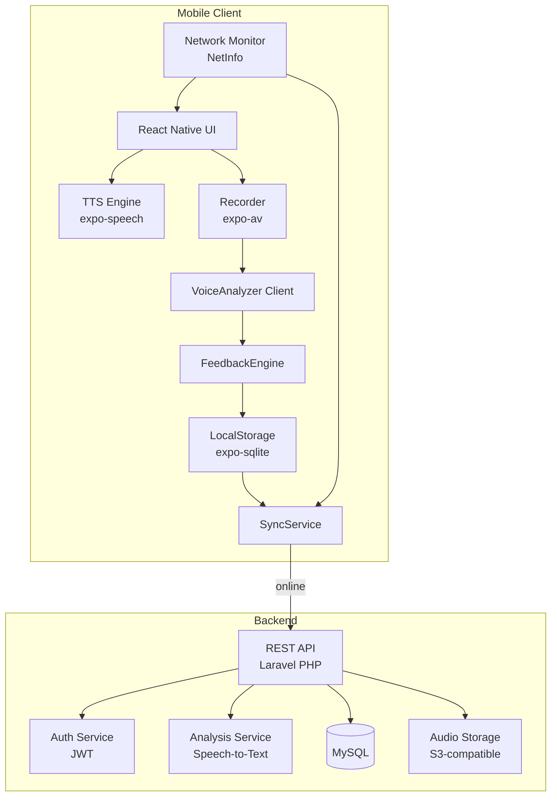

# Design Document: Mobile Reading App

## Overview

The Mobile Reading App is a cross-platform mobile application (iOS and Android) that helps students improve reading skills through guided text-to-speech playback, voice recording, and automated pronunciation and fluency analysis. It operates fully offline with background sync to a server when connectivity is available, and exposes a teacher dashboard for monitoring student progress.

The app is built with React Native (Expo) for the mobile client, a PHP REST API backend (Laravel), and MySQL for server-side persistence. SQLite (via expo-sqlite) serves as the on-device LocalStorage layer. Voice analysis is handled by a cloud-based speech recognition service (e.g., Google Cloud Speech-to-Text) invoked from the backend, so the mobile client only ships audio and receives structured results.

### Key Design Goals

- Offline-first: all core reading, recording, and feedback flows work without connectivity
- Sync reliability: no ProgressRecord is ever lost due to transient network failures
- Separation of concerns: TTS, recording, analysis, and sync are independent modules
- Role-based access: teacher dashboard is server-enforced, not just client-gated

---

## Architecture



### Connectivity Flow

On launch, `NetInfo` checks connectivity. The app loads from `LocalStorage` regardless of connectivity state, then overlays online features (download, sync, dashboard) when online. The `SyncService` listens for connectivity changes and triggers upload of pending `ProgressRecord`s automatically.

---

## Components and Interfaces

### TTS Engine (`TTSEngine`)

Wraps `expo-speech` to provide word-level highlight events.

```ts
interface TTSEngine {
  speak(text: string, options: TTSOptions): void;
  pause(): void;
  resume(): void;
  stop(): void;
  onWordBoundary(callback: (wordIndex: number) => void): void;
  onComplete(callback: () => void): void;
}

interface TTSOptions {
  rate: number;       // 0.5–2.0, derived from ReadingMaterial.level
  language: string;
}
```

### Recorder (`RecorderService`)

Wraps `expo-av` Audio recording API.

```ts
interface RecorderService {
  requestPermission(): Promise<PermissionStatus>;
  startRecording(): Promise<void>;
  stopRecording(): Promise<RecordingResult>;
}

interface RecordingResult {
  uri: string;          // local file path
  durationMs: number;
  sampleRate: number;   // minimum 16000 Hz
}
```

### VoiceAnalyzer Client (`VoiceAnalyzerClient`)

Uploads audio to the backend analysis endpoint and returns structured results.

```ts
interface VoiceAnalyzerClient {
  analyze(recordingUri: string, materialId: string): Promise<AnalysisResult>;
}

interface AnalysisResult {
  mispronounced: MispronunciationDetail[];
  pace: 'too_slow' | 'appropriate' | 'too_fast';
  accuracyScore: number;   // 0–100
  wordAccuracy: number;    // 0–100
  fluencyScore: number;    // 0–100
}

interface MispronunciationDetail {
  word: string;
  expected: string;
  actual: string;
  offsetMs: number;
}
```

### FeedbackEngine (`FeedbackEngine`)

Pure function — converts `AnalysisResult` into a human-readable `FeedbackReport`.

```ts
interface FeedbackEngine {
  generate(analysis: AnalysisResult, material: ReadingMaterial): FeedbackReport;
}

interface FeedbackReport {
  mispronounced: MispronunciationDetail[];
  pace: 'too_slow' | 'appropriate' | 'too_fast';
  accuracyScore: number;
  suggestions: string[];   // at least 1 item always
  generatedAt: string;     // ISO timestamp
}
```

### LocalStorage (`LocalStorageService`)

Thin wrapper over `expo-sqlite` providing typed CRUD for all local entities.

```ts
interface LocalStorageService {
  saveProgressRecord(record: ProgressRecord): Promise<void>;
  getProgressRecords(userId: string): Promise<ProgressRecord[]>;
  markSynced(recordId: string): Promise<void>;
  getUnsynced(): Promise<ProgressRecord[]>;
  saveMaterial(material: ReadingMaterial): Promise<void>;
  getMaterials(): Promise<ReadingMaterial[]>;
  saveSession(session: LocalSession): Promise<void>;
  getSession(): Promise<LocalSession | null>;
}
```

### SyncService (`SyncService`)

Runs in the background; triggered by connectivity events and app foreground events.

```ts
interface SyncService {
  start(): void;
  stop(): void;
  syncNow(): Promise<SyncResult>;
}

interface SyncResult {
  uploaded: number;
  failed: number;
  errors: SyncError[];
}
```

### REST API Endpoints

The backend is implemented as a Laravel PHP application exposing a JSON REST API. Routes are defined in `routes/api.php` and protected via Laravel Sanctum (JWT-compatible token auth).

| Method | Path | Auth | Description |
|--------|------|------|-------------|
| POST | `/auth/login` | none | Authenticate user, return JWT |
| GET | `/materials` | JWT | List available reading materials |
| GET | `/materials/:id/download` | JWT | Download material for offline use |
| POST | `/analysis` | JWT | Submit audio for voice analysis |
| POST | `/progress` | JWT | Upload ProgressRecord(s) |
| GET | `/teacher/students` | Teacher JWT | List students with synced records |
| GET | `/teacher/students/:id/progress` | Teacher JWT | Get student ProgressRecords |

---

## Data Models

### ReadingMaterial

```ts
interface ReadingMaterial {
  id: string;
  title: string;
  text: string;             // full passage text
  level: ReadingLevel;      // 'beginner' | 'intermediate' | 'advanced'
  defaultTTSRate: number;   // derived from level
  language: string;
  bundled: boolean;         // true = shipped with app, false = downloaded
  downloadedAt?: string;    // ISO timestamp
}
```

### ProgressRecord

```ts
interface ProgressRecord {
  id: string;
  userId: string;           // local guest ID or registered user ID
  materialId: string;
  sessionScore: number;     // 0–100 composite
  accuracyScore: number;
  fluencyScore: number;
  pace: 'too_slow' | 'appropriate' | 'too_fast';
  feedbackSummary: string;
  recordingUri: string;     // local path or remote URL after sync
  completedAt: string;      // ISO timestamp
  synced: boolean;
  syncedAt?: string;
}
```

### LocalSession

```ts
interface LocalSession {
  id: string;
  userId: string;
  isGuest: boolean;
  createdAt: string;
}
```

### User (server-side)

```ts
interface User {
  id: string;
  email: string;
  passwordHash: string;
  role: 'student' | 'teacher' | 'admin';
  createdAt: string;
}
```

### Database Schema (MySQL)

```sql
CREATE TABLE users (
  id CHAR(36) PRIMARY KEY DEFAULT (UUID()),
  email VARCHAR(255) UNIQUE NOT NULL,
  password_hash VARCHAR(255) NOT NULL,
  role ENUM('student', 'teacher', 'admin') NOT NULL,
  created_at TIMESTAMP DEFAULT CURRENT_TIMESTAMP
);

CREATE TABLE reading_materials (
  id CHAR(36) PRIMARY KEY DEFAULT (UUID()),
  title VARCHAR(255) NOT NULL,
  text LONGTEXT NOT NULL,
  level VARCHAR(50) NOT NULL,
  default_tts_rate DECIMAL(4,2) NOT NULL,
  language VARCHAR(10) NOT NULL DEFAULT 'en',
  bundled TINYINT(1) DEFAULT 0
);

CREATE TABLE progress_records (
  id CHAR(36) PRIMARY KEY DEFAULT (UUID()),
  user_id CHAR(36) NOT NULL,
  material_id CHAR(36) NOT NULL,
  session_score DECIMAL(5,2) NOT NULL,
  accuracy_score DECIMAL(5,2) NOT NULL,
  fluency_score DECIMAL(5,2) NOT NULL,
  pace VARCHAR(20) NOT NULL,
  feedback_summary TEXT,
  recording_url VARCHAR(2048),
  completed_at TIMESTAMP NOT NULL,
  created_at TIMESTAMP DEFAULT CURRENT_TIMESTAMP,
  FOREIGN KEY (user_id) REFERENCES users(id),
  FOREIGN KEY (material_id) REFERENCES reading_materials(id)
);
```

---

## Correctness Properties

*A property is a characteristic or behavior that should hold true across all valid executions of a system — essentially, a formal statement about what the system should do. Properties serve as the bridge between human-readable specifications and machine-verifiable correctness guarantees.*

### Property 1: Connectivity mode routing

*For any* app launch, if connectivity is detected the app should enter online mode, and if no connectivity is detected the app should enter offline mode and load from LocalStorage.

**Validates: Requirements 1.2, 1.3**

---

### Property 2: Valid login loads profile

*For any* registered user with valid credentials, authenticating should result in the app loading that user's profile and progress data.

**Validates: Requirements 2.2**

---

### Property 3: Invalid credentials produce error

*For any* credential pair that does not match a registered user, the authentication attempt should result in an error message being displayed and no session being created.

**Validates: Requirements 2.3**

---

### Property 4: Guest session persistence round-trip

*For any* guest mode selection, a local session should be created and retrievable from LocalStorage immediately after selection.

**Validates: Requirements 2.4**

---

### Property 5: Material list filtering invariant

*For any* set of materials in LocalStorage, the displayed material list should contain only materials that are either bundled with the app or have been explicitly downloaded — never materials that are neither.

**Validates: Requirements 3.2**

---

### Property 6: Material selection navigates to session

*For any* available reading material, selecting it should navigate the user to the reading session view for that specific material.

**Validates: Requirements 3.3**

---

### Property 7: TTS rate matches reading level

*For any* reading material, the TTS engine should use the default rate corresponding to that material's reading level when playback begins.

**Validates: Requirements 4.6**

---

### Property 8: Word highlight tracks TTS position

*For any* word boundary event emitted by the TTS engine during playback, the word at that index should be highlighted in the passage display.

**Validates: Requirements 4.2**

---

### Property 9: TTS pause-resume round-trip

*For any* TTS playback session, pausing and then resuming should restore playback from the same word position that was active at the time of pause.

**Validates: Requirements 4.4, 4.5**

---

### Property 10: Recording saved to LocalStorage

*For any* completed recording session, stopping the recorder should result in the audio file being saved to LocalStorage and retrievable by its URI.

**Validates: Requirements 5.5**

---

### Property 11: Recording sample rate invariant

*For any* recording captured by the Recorder, the sample rate of the resulting audio file should be at least 16000 Hz.

**Validates: Requirements 5.6**

---

### Property 12: Analysis result completeness

*For any* saved recording submitted to the VoiceAnalyzer, the returned AnalysisResult should contain all four metrics: pronunciation accuracy, reading speed (pace), word accuracy, and fluency score.

**Validates: Requirements 6.1**

---

### Property 13: Feedback report completeness and suggestion guarantee

*For any* AnalysisResult, the FeedbackEngine should produce a FeedbackReport that contains: a mispronounced words list, a pace assessment, an accuracy score, and a suggestions array with at least one item.

**Validates: Requirements 6.2, 6.5**

---

### Property 14: ProgressRecord completeness

*For any* completed reading session, the ProgressRecord saved to LocalStorage should contain: session score, recording reference, feedback summary, and a completion timestamp.

**Validates: Requirements 7.1**

---

### Property 15: ProgressRecord persistence across restarts

*For any* set of ProgressRecords saved to LocalStorage, those records should still be present and unchanged after simulating an app restart (closing and reopening the database connection).

**Validates: Requirements 7.2**

---

### Property 16: Sync round-trip

*For any* unsynced ProgressRecord, when connectivity becomes available the SyncService should upload it to the server and then mark it as synced in LocalStorage.

**Validates: Requirements 7.3, 7.4**

---

### Property 17: Sync retry on failure

*For any* ProgressRecord that fails to upload, the SyncService should retain the record in LocalStorage (not delete it) and include it in the next sync attempt.

**Validates: Requirements 7.5**

---

### Property 18: Teacher dashboard shows student records

*For any* student with synced ProgressRecords, selecting that student in the teacher dashboard should display all their records including scores, feedback summaries, and timestamps.

**Validates: Requirements 8.2**

---

### Property 19: Teacher dashboard access control

*For any* user without a teacher or admin role, any request to the teacher dashboard endpoints should be rejected with an authorization error.

**Validates: Requirements 8.3**

---

### Property 20: Dashboard reflects new syncs

*For any* ProgressRecord synced from a student device, the teacher dashboard should include that record in its data without requiring a manual refresh action.

**Validates: Requirements 8.4**

---

### Property 21: Repeat session creates new record

*For any* reading material that has been completed at least once, repeating the session and completing it should result in a new ProgressRecord being added to LocalStorage, leaving all previous records for that material unchanged.

**Validates: Requirements 9.1, 9.2**

---

## Error Handling

### Network Errors

- All API calls are wrapped in try/catch; failures surface a user-friendly toast/banner, never a raw error
- `SyncService` uses exponential backoff (1s, 2s, 4s, max 30s) for upload retries
- If the backend analysis endpoint is unreachable, the app displays "Analysis unavailable — please try again when online" and offers re-record

### Microphone Permission Denied

- On denial, recording is blocked and a modal explains why microphone access is needed, with a deep-link to device settings

### VoiceAnalyzer Failure

- If the backend returns a non-2xx response for `/analysis`, the app shows a descriptive error and presents a "Try Again" button that re-submits the same recording without requiring a new recording

### LocalStorage Errors

- SQLite errors during write are caught; the app retries once, then shows a persistent error banner if the retry fails
- On app launch, if the database cannot be opened, the app falls back to in-memory state and warns the user that progress will not be saved

### Authentication Errors

- 401 responses clear the local session and redirect to the login screen
- 403 responses (e.g., non-teacher accessing dashboard) show "Access denied" without exposing role details

### Empty LocalStorage + No Connectivity

- Detected at launch; a full-screen informational message is shown with instructions to connect to the internet to download content

---

## Testing Strategy

### Dual Testing Approach

Both unit tests and property-based tests are required. They are complementary:

- Unit tests cover specific examples, integration points, and error conditions
- Property-based tests verify universal correctness across randomized inputs

### Unit Tests

Focus areas:
- `FeedbackEngine.generate()` with specific AnalysisResult fixtures (correct report structure, edge cases like zero mispronunciations)
- `SyncService` retry logic with mocked network failures
- Authentication flow with valid/invalid credential fixtures
- Teacher dashboard access control with different role fixtures
- LocalStorage CRUD operations with known data
- Error handling paths (permission denied, analysis failure, empty storage)

### Property-Based Tests

Library: **fast-check** (TypeScript/JavaScript, works in React Native test environment via Jest)

Configuration: minimum **100 iterations** per property test.

Each test must be tagged with a comment in the format:
`// Feature: mobile-reading-app, Property N: <property_text>`

| Property | Test Description |
|----------|-----------------|
| P1 | For any connectivity state, app mode matches connectivity |
| P2 | For any valid user, login loads correct profile |
| P3 | For any invalid credentials, error is shown and no session created |
| P4 | For any guest selection, session is in LocalStorage |
| P5 | For any material set, displayed list contains only bundled/downloaded |
| P6 | For any material, selection navigates to session view |
| P7 | For any material, TTS rate matches level default |
| P8 | For any word boundary event, correct word is highlighted |
| P9 | For any playback, pause then resume restores position |
| P10 | For any recording, stop saves file to LocalStorage |
| P11 | For any recording, sample rate >= 16000 Hz |
| P12 | For any recording, analysis result contains all four metrics |
| P13 | For any analysis result, feedback has all fields and >= 1 suggestion |
| P14 | For any session, ProgressRecord has all required fields |
| P15 | For any saved records, they persist across restart |
| P16 | For any unsynced record, sync uploads and marks synced |
| P17 | For any failed upload, record is retained and retried |
| P18 | For any student, dashboard shows all their records |
| P19 | For any non-teacher user, dashboard access is denied |
| P20 | For any synced record, dashboard reflects it without refresh |
| P21 | For any repeated session, new record added, old records unchanged |

### Integration Tests

- Full offline flow: launch with no connectivity → load from LocalStorage → complete session → verify ProgressRecord saved
- Full sync flow: complete session offline → restore connectivity → verify SyncService uploads and marks synced
- Teacher dashboard: sync student records → verify dashboard API returns them with correct structure

### Test Environment

- Jest + React Native Testing Library for unit and property tests
- Detox for end-to-end mobile integration tests
- Mock `expo-speech`, `expo-av`, `NetInfo`, and `expo-sqlite` in unit/property test environments
- PHPUnit for Laravel backend unit and integration tests
- Dedicated test MySQL instance for backend integration tests
